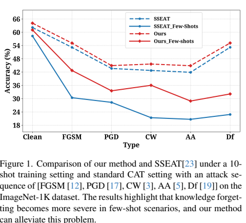
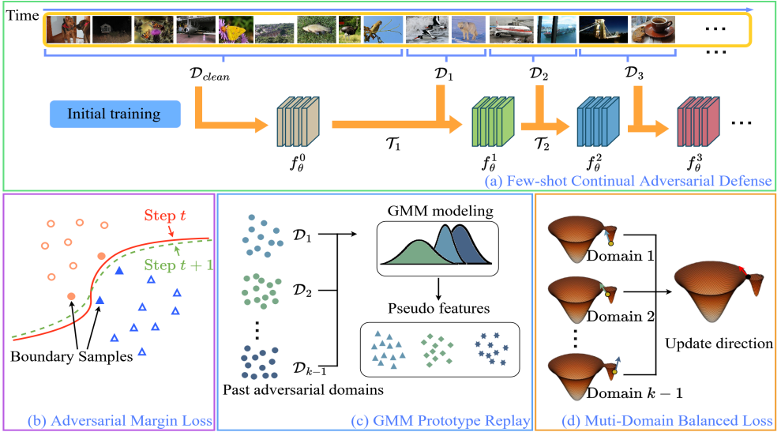
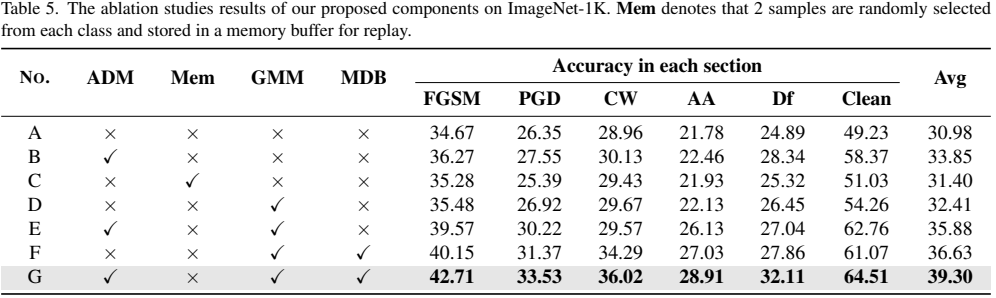
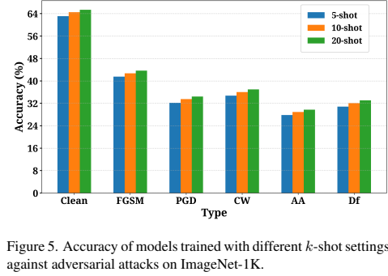

# Robustness Under Data Scarcity: Few-Shot Continual Adversarial Training for Evolving Threats(CVPR2026)

[project](#) [paper](#)

## Overview

Few-shot Continual Adversarial Training (FS-CAT) studies a practical continual
defense setting where a model meets a sequence of evolving adversarial domains
but receives only a small number of adversarial samples at each stage. Existing
continual adversarial training methods usually assume sufficient adversarial
data for every new attack, which makes them less suitable for data-scarce
real-world scenarios.

This repository provides a local reproduction pipeline for FS-CAT. The method
contains three key components: Adversarial Margin loss, GMM Prototype Replay,
and Multi-Domain Balanced loss.

<p align="center">
  
</p>

## Method

### Adversarial Margin Loss

ADM explicitly increases the distance between clean samples and their nearest
decision boundary during clean pretraining. It uses the logit margin
`phi_y(x) = z_y(x) - max_{y' != y} z_y'(x)` and approximates the closest
boundary point inside an epsilon ball.

### GMM Prototype Replay

For each previous adversarial domain, FS-CAT extracts penultimate features and
fits class-wise Gaussian mixture prototypes. During later stages, replayed
pseudo-features are sent directly to the classifier, avoiding raw-image storage.

### Multi-Domain Balanced Loss

MDB stabilizes continual learning by reducing the variance of replay losses
across previously seen adversarial domains.

<p align="center">
  
</p>

## Environment Setups

Create and activate a conda environment, then install the dependencies:

```sh
conda create -n FS_CAT python=3.10 -y
conda activate FS_CAT
pip install -r requirements.txt
```

The main dependencies are PyTorch, torchvision, and PyYAML.

## Data Preparation

Following the SSEAT-style pipeline, adversarial samples should be generated
before training and placed in the dataset directory. This repository does not
include code for generating FGSM, PGD, CW, AutoAttack, DeepFool, or other
adversarial examples.

Please fill the empty paths in the YAML config files before running. Each path
should point to a `torch.save` file such as `FGSM.pth`, `PGD.pth`, `CW.pth`,
`AA.pth`, or `Df.pth`.

Example directory layout:

```text
/dataset
|-- ImageNet1K
|   |-- clean_train.pth
|   |-- clean_val.pth
|   `-- data
|       |-- FGSM.pth
|       |-- PGD.pth
|       |-- CW.pth
|       |-- AA.pth
|       `-- Df.pth
`-- CIFAR100
    |-- clean_train.pth
    |-- clean_val.pth
    `-- data
        |-- FGSM.pth
        |-- PGD.pth
        |-- CW.pth
        |-- AA.pth
        `-- Df.pth
```

Supported `.pth` formats:

```python
{"images": images, "labels": labels}
{"data": images, "targets": labels}
(images, labels)
[(image, label), ...]
```

## RUN

The ImageNet-1K 10-shot setting is configured in:

```text
configs/fs_cat_imagenet10shot.yaml
```

The CIFAR-100 10-shot setting is configured in:

```text
configs/fs_cat_cifar100_10shot.yaml
```

Run the full pipeline:

```sh
python -m fs_lifelong_at.main \
  --config configs/fs_cat_imagenet10shot.yaml \
  --stage all
```

You can also run individual stages:

```sh
python -m fs_lifelong_at.main --config configs/fs_cat_imagenet10shot.yaml --stage pretrain
python -m fs_lifelong_at.main --config configs/fs_cat_imagenet10shot.yaml --stage continual
python -m fs_lifelong_at.main --config configs/fs_cat_imagenet10shot.yaml --stage eval
```

## Paper-aligned Settings

| Item | Setting |
| --- | --- |
| Backbone | ResNet-50 |
| Optimizer | Adam |
| Learning rate | `1e-3` |
| Batch size | `64` |
| Few-shot setting | `10` shots per class |
| GMM components | `lambda1 = 4` |
| MDB coefficient | `lambda2 = 0.1` |
| Short attack sequence | `[FGSM, PGD, CW, AA, Df]` |
| Long attack sequence | `[FGSM, BIM, PGD, SA, BS, MCG, DIM]` |

<p align="center">
  
</p>

<p align="center">
  
</p>

## Code Structure

```text
fs_lifelong_at/
|-- losses/
|   |-- adversarial_margin.py   # ADM loss
|   `-- mdb.py                  # MDB loss
|-- replay/
|   `-- gmm.py                  # GMM prototype replay
|-- data.py                     # pre-generated dataset loader
|-- models.py                   # ResNet feature/classifier wrapper
|-- trainer.py                  # continual training pipeline
`-- main.py                     # entrypoint
```

## Citation

```bibtex
@inproceedings{fs_cat2026,
  title={Robustness Under Data Scarcity: Few-Shot Continual Adversarial Training for Evolving Threats},
  author={Anonymous},
  booktitle={Proceedings of the IEEE/CVF Conference on Computer Vision and Pattern Recognition},
  year={2026}
}
```
